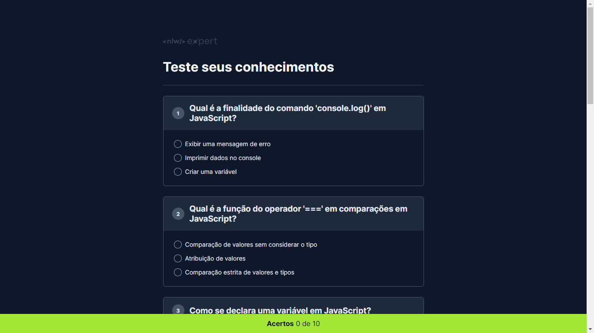

# PROJETO QUIZ JAVASCRIPT

## 📝Finalidade
- Site desenvolvido para fixação de conteúdos em JavasScript.
- Pode ser utilizado como material de estudo para quem está aprendendo JavaScript

## 👨‍💻Funcionalidade
- [x] O site avalia se você respondeu corretamente a opção marcada.

- [x] Seus acertos são contabilizados no JavaScript e impressos na parte de baixo da tela.

# Print



## 💻Como rodar este projeto?

Após clonar o repositório, acesse a pasta do projeto e execute os comandos abaixo:

```bash
npm install
npm run dev
```

Acesse [http://localhost:5173](http://localhost:5173) para visualizar a aplicação.

## 🔧Tecnologias Utilizadas 


# 🔗Link para acessar o deploy no GitHub

[Deploy do Projeto Quiz JavaScritpt](https://pedrobezerra14.github.io/nlw-quiz/)

